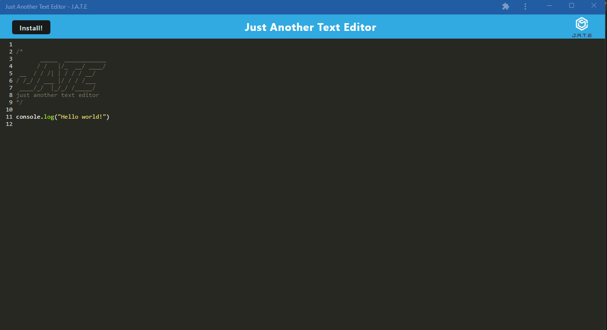
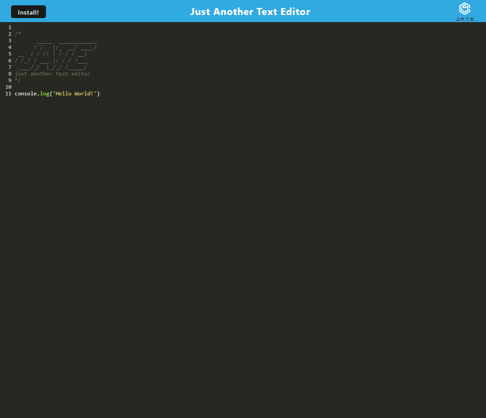

# Text Editor

## Licensing:

## Table of Contents 
- [Description](#description)
- [Installation](#installation)
- [Usage](#usage)
- [License](#license)
- [Contributing](#contributing)
- [Tests](#tests)
- [Questions](#questions)

## Description:
This is a text editor application created in the UW Coding Bootcamp. The test editor runs in a browser and can be installed on a computer.

## Installation:
- Front-end access at https://murmuring-garden-28398.herokuapp.com/ and click on the install button on that page
- To use the code in the repository, Clone the repository
- In the command line type npm i
- In the command line type npm run start
- This will run on http://localhost:3000/

## Usage:

Link to Heroku Website:

https://murmuring-garden-28398.herokuapp.com/

- To install to your computer, click on the install button on the webpage

Screenshots:

Installed Version:

Web Version:

## License:
MIT

## Contributing:
There was already a starter code provided for this project here: https://github.com/coding-boot-camp/cautious-meme (which is why your see contributors listed in the repo).

Contributions are welcome through forking my repository.

## Tests:
None

## Questions:
- Github: [andreahergert](https://github.com/andreahergert)
- Email: ahergert24@hotmail.com 